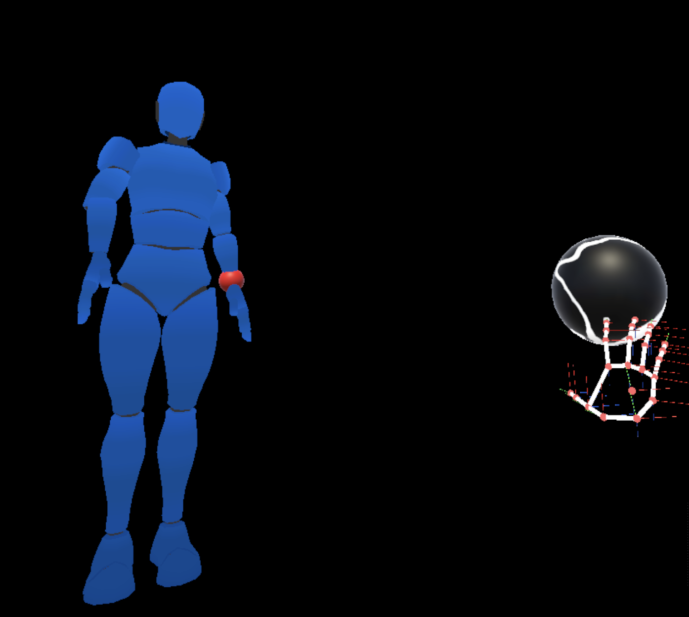

# LifeSaver

This project aims to decentralize healthcare by empowering user's with access to medical equipment as well as guide them through its usage via our AI assistant AILA. We are currently using the XReal One, and have previously used: Apple Vision Pro, Oculus Quest 2, and Magic Leap 2. My main responsibility on this project has been in the UI/UX. I have also worked on setting up Vuplex WebViewer, Image and Marker tracking, and connecting the backend server to our frontend application.

    

## Walkthrough of the Feature Setup

This section provides a step-by-step visual guide to setting up the feature. Follow the screenshots below to see how the interface progresses through each stage.

### The first step:
Upon initialization of the app, you will be presented with AILA on the right hand side of your screen. She will follow your movements in order to be accessible at all times. In this scenario we have an injured man on the left that we will be using AILA to get first aid assistance.

  

### The second step:
When ready to begin, the user can interact with AILA by moving their hand to a close proximity to AILA. This will put AILA in her next stage which is indicated by the color change to orange. In this state, AILA will be recording the user who will be specifying the current conditions of the patient or requesting AILA to perform a specific action. In this scenario, the user will ask AILA to open a webpage that can assist the user.

  

### The third step:
Once the user has finished talking or the user interacts with AILA in the same way (Assuming the user removed their hand from AILA after beginning the recording state), AILA will change colors orange to white, indicating that she is now in the processing state. This state has AILA connect with the back end server, and send over the context of the scene (what the user is directly looking at) as well as what the user has stated. As the user in our case has requested a webpage to be opened, AILA will then return a json file to Unity where it is then processed to carry out that function.

  

### The last step:
Upon completion of the AILA request and a successful transfer of information between the server and frontend, AILA will return back to her base stage indicated by her returning to a blue color. In our case, the function that was called was instantiating a webpage which will show a specific webpage hosted on our server. This webpage is interactive and thus can me moved around the scene and allow the user to click, scroll, and close the website.

  

## Bonus Features:
There is also the addition of having a hand menu that is attached to the right hand. This menu was made by me and gives the user quick access to specific webpages on the backend server. The current options found on the hand menu follow this order: Camera, Timer, Map, Patient. The patient menu operates differently as selecting it will open a sub menu that will give access to the user's data (indiicated by the isolated person on the left) and recent patients' data. By selecting any of these options, the menu will open up the corresponding webpage in front of the user.

  
  

